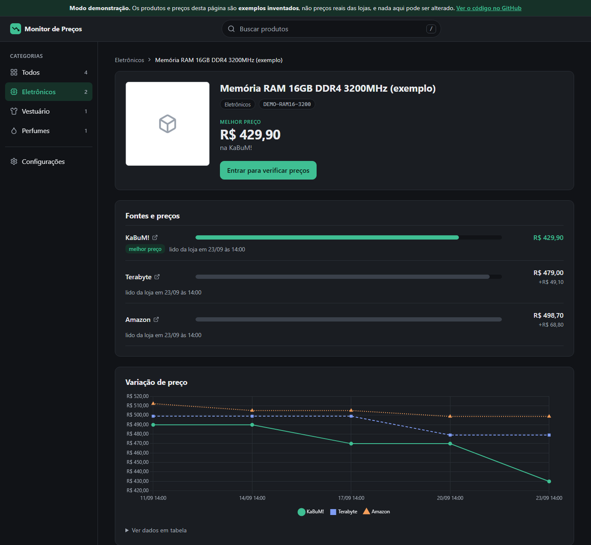
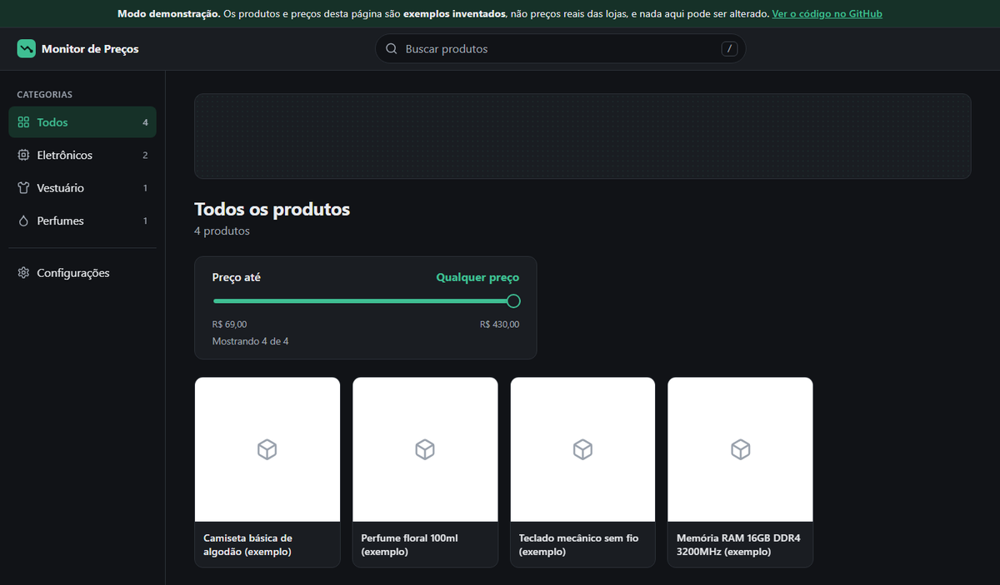

[](https://github.com/GuilhermeWaldemir/monitor-de-precos/actions/workflows/tests.yml)

Compara o preço do **mesmo produto** em várias lojas online brasileiras, guarda o histórico e avisa por e-mail quando o preço cai.

**[Ver o site funcionando →](https://monitor-de-precos-4fj2.onrender.com)** (demonstração com dados de exemplo; a primeira visita pode demorar ~50 s, porque o servidor gratuito dorme quando ninguém acessa)

<p align="center">
  
</p>
<p align="center">
  
</p>

> As imagens usam o modo demonstração: os produtos e preços são exemplos inventados.

## Funcionalidades

- **Comparação entre lojas** — cada produto reúne os links de várias lojas, ordenados do mais barato ao mais caro, com o melhor preço em destaque.
- **Histórico e gráfico** — toda verificação fica guardada, e a tela do produto mostra a variação de preço num gráfico de linhas.
- **Alerta de queda por e-mail** — quando o melhor preço cai 4% ou mais, o aviso chega por e-mail para quem tem conta.
- **Verificação diária automática** — todo dia às 12:30 os preços são conferidos sozinhos, sem o site aberto.
- **Mercado Livre pela API oficial** — com a conta conectada (OAuth), os preços vêm da API da loja em vez da página.
- **Capturar preço do navegador** — um botão de favoritos lê o preço da página que você já está vendo, para as lojas que bloqueiam leitura automática.
- **Organização** — categorias com ícones, pesquisa, filtro por faixa de preço e sugestão de produtos parecidos.
- **Contas** — cadastro e login; visitantes só olham, e só quem está logado altera dados.
- **Configurações** — tema claro/escuro/automático, escolha de fontes e animações que podem ser desligadas.

## Tecnologias

| Camada | Tecnologia |
|---|---|
| Back-end | Python 3.13, Flask 3.1 |
| Leitura das páginas | requests, Beautiful Soup 4, JSON-LD (schema.org) |
| Banco | SQLite |
| Interface | Jinja2, CSS e JavaScript puros, Chart.js |
| E-mail | SMTP (`smtplib`) |
| Testes e CI | pytest, GitHub Actions |
| Hospedagem | Render (gunicorn) |

## Como funciona

1. Você organiza os produtos em **categorias** (Eletrônicos, Vestuário, Perfumes ou as que criar).
2. Cadastra um produto com o link dele em cada loja e, se quiser, um **código do fabricante ou EAN** (ex.: `KF432C16BB1/16`).
3. O programa lê preço, foto e estoque de cada link: pelo bloco **JSON-LD** (padrão schema.org), pelo HTML na Amazon ou pela API no Mercado Livre.
4. Ele confere se cada página é mesmo aquele produto, comparando o código.
5. Cada verificação vai para o histórico no **SQLite**, e o alerta compara o novo melhor preço com o último preço de referência.

| Loja | Leitura |
|---|---|
| KaBuM!, Terabyte e outras lojas com JSON-LD | automática |
| Amazon | automática (HTML) |
| Mercado Livre | API oficial, com a conta conectada |
| Magazine Luiza e lojas que bloqueiam robôs | favorito "Capturar preço" ou preço manual |

Decisões por trás disso:

- **Não burlar bloqueio de loja.** Quando uma loja recusa leitura automática, o projeto usa o caminho legítimo: a API oficial ([`mercadolivre.py`](monitor/mercadolivre.py)) ou a leitura feita pelo próprio usuário na página que ele abriu ([`bookmarklet.js`](monitor/static/js/bookmarklet.js)).
- **Dinheiro em `Decimal`, nunca `float`.** `float` erra centavos em contas simples; os preços são guardados em centavos e formatados como "R$ 1.299,90" só na tela ([`prices.py`](monitor/prices.py)).
- **Referência móvel no alerta.** Quedas pequenas se somam até passar de 4%, e uma queda já avisada não gera outro e-mail ([`alerts.py`](monitor/alerts.py)).
- **Uma loja falhar não derruba as outras.** Cada link é verificado de forma isolada, e o erro aparece só naquela loja ([`checker.py`](monitor/checker.py)).
- **Serviço externo fora do ar não quebra o site.** Se o e-mail falhar, o preço é gravado mesmo assim e o alerta fica pendente para tentar de novo.

## Segurança

- **Senhas com hash.** Só o hash da senha é guardado, e a mensagem de erro é a mesma para "e-mail não existe" e "senha errada", para não revelar quem tem conta.
- **Proteção CSRF.** Todos os 16 formulários levam um token aleatório por sessão, e qualquer POST sem ele é recusado ([`csrf.py`](monitor/csrf.py)).
- **Sessão protegida.** A chave que assina o cookie vem do `.env` ou é gerada na hora, nunca fica no código. O cookie é `HttpOnly` e `SameSite=Lax`, e a sessão é recriada a cada login.
- **Sem redirecionamento aberto.** Depois do login, o site só volta para endereços internos.
- **OAuth com `state` e PKCE** na conexão com o Mercado Livre, com o token renovado automaticamente.
- **Segredos fora do Git.** Senha do e-mail, chaves da API e da sessão ficam no `.env` (veja o [`.env.example`](.env.example)).
- **Demonstração só de leitura.** O site público recusa todo POST, então visitantes não conseguem alterar os dados.

## Testes

```powershell
pytest
```

São **421 testes** e nenhum acessa a internet: as páginas das lojas são cópias reais salvas em `tests/fixtures`, e o envio de e-mail e a API do Mercado Livre são substituídos por versões falsas. Por isso eles rodam iguais em qualquer máquina.

Além da leitura de preços, cobrem as regras do alerta (queda exata de 4%, quedas que se somam, loja sem estoque), a migração de bancos antigos, o login, a recusa de POST sem token CSRF (sem desligar a proteção nos testes) e até a configuração do deploy.

Eles rodam sozinhos no GitHub Actions a cada envio para a `main` e a cada pull request, e o resultado é o selo no topo deste arquivo.

## Rodando localmente

Requer Python 3.13.

```powershell
py -m venv .venv
.venv\Scripts\Activate.ps1
pip install -r requirements.txt

flask --app monitor.app run --debug   # abre em http://127.0.0.1:5000
```

O banco é criado automaticamente em `data/monitor.db`, já com as três categorias iniciais.

Para os alertas por e-mail e a conexão com o Mercado Livre, copie o `.env.example` para `.env` e preencha. Sem ele, o site funciona normalmente, só sem essas duas partes. Para rodar o modo demonstração ou publicar o site, veja o [`docs/deploy.md`](docs/deploy.md).

## Estrutura

```
monitor/
├── app.py                       # site (Flask): rotas e páginas
├── fetcher.py, readers.py,
│   jsonld.py, amazon.py,
│   mercadolivre.py, capture.py  # leitura de preços: páginas, API e favorito
├── matching.py, stores.py       # confere o código do produto e identifica a loja
├── checker.py, compare.py       # verifica os links e escolhe o melhor preço
├── alerts.py, emailer.py,
│   daily_check.py               # alerta de queda, e-mail e verificação diária
├── auth.py, csrf.py             # contas e proteção dos formulários
├── db.py                        # SQLite: tabelas e migrações
├── templates/                   # HTML (Jinja2)
└── static/                      # CSS, JavaScript e Chart.js
tests/
└── fixtures/                    # páginas reais salvas das lojas
docs/                            # diário, problemas resolvidos e deploy
```

## Diário e problemas resolvidos

- [docs/diario.md](docs/diario.md): o que foi construído em cada etapa, por que, e o que se aprendeu.
- [docs/problemas-resolvidos.md](docs/problemas-resolvidos.md): 15 problemas reais e como foram resolvidos, como a loja que bloqueava robôs e o acesso ao Mercado Livre que expirava a cada 6 horas.

## Próximos passos

- [x] Alerta de queda de preço por e-mail
- [x] Mercado Livre pela API oficial
- [x] Proteção CSRF e chave de sessão fora do código
- [x] Site publicado em modo demonstração
- [ ] README em inglês, com GIF de demonstração
- [ ] Hospedagem que não dorme (o PythonAnywhere é a alternativa anotada em `docs/deploy.md`)
